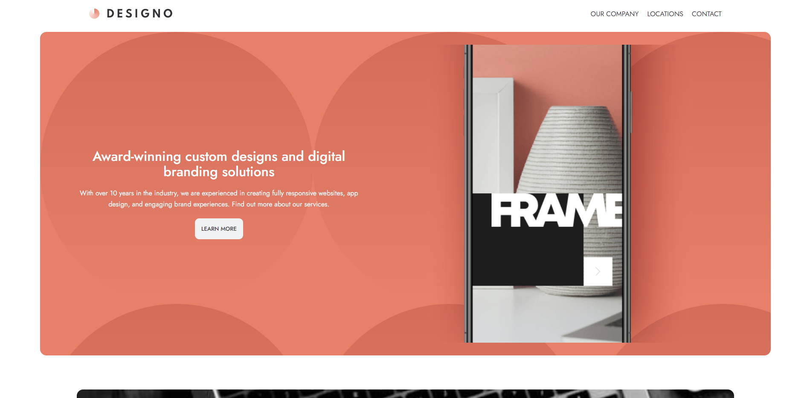
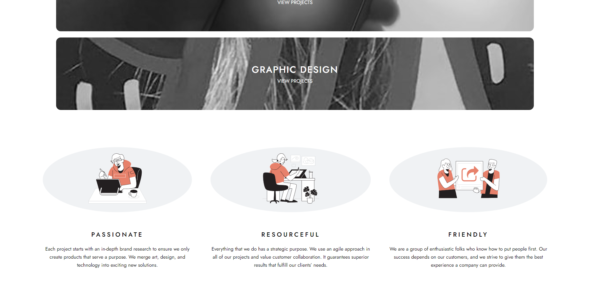
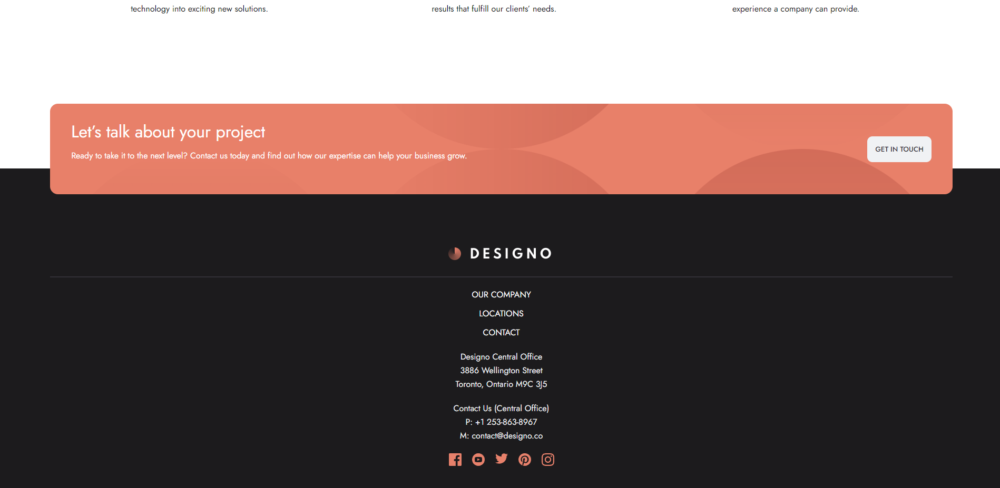
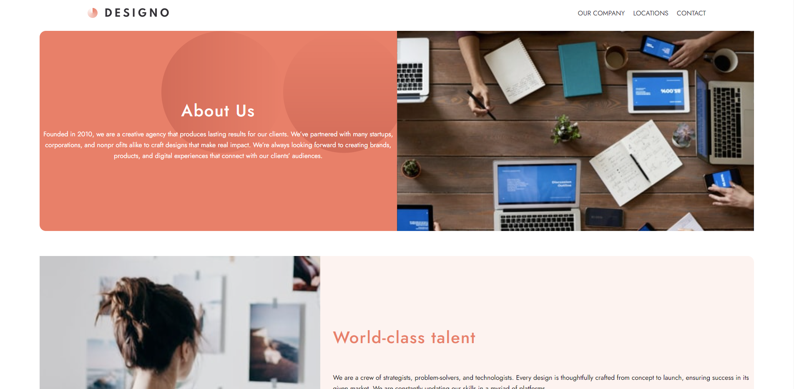
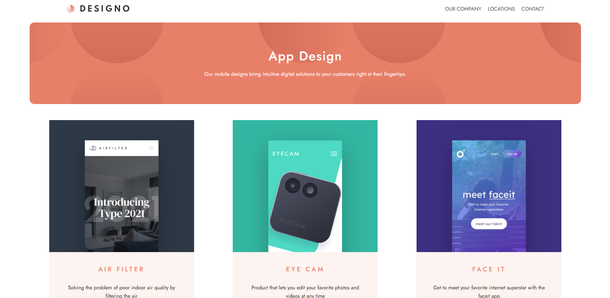
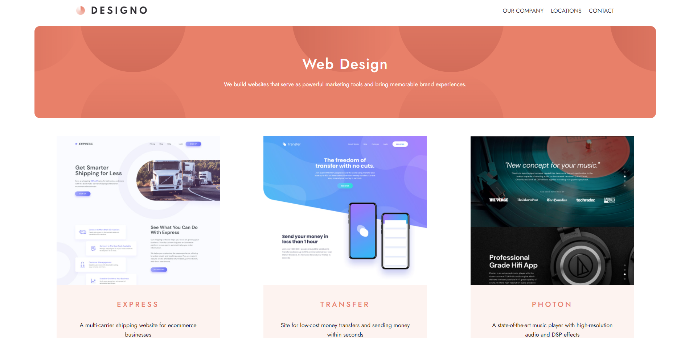
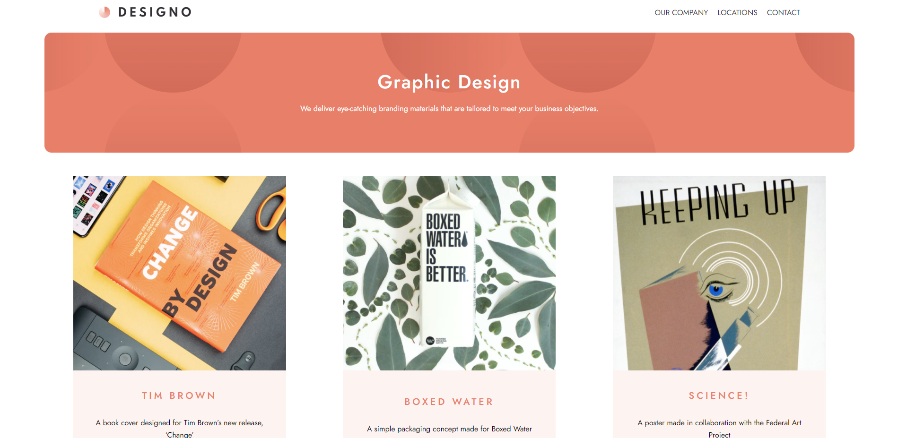
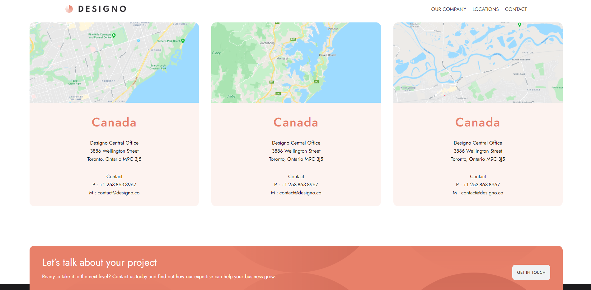

# Hi there ✋!<br>
## HappyPizza is website i designed and built from scratch<br>
<div><br>


  
  
   
   
   
   
   
</div>

## Technologies i've used:
<p>

  
  
  

</p>

## Why did i build it?
I want to learn Sass. Design provided by frontendmentor.io.


## Editor i use:
<p>

</p>

### Installation


1. Clone the repo
   ```sh
   git clone https://github.com/hubertkarwowski/shop.git
   ```
2. Install NPM packages
   ```sh
   npm install
   ```


